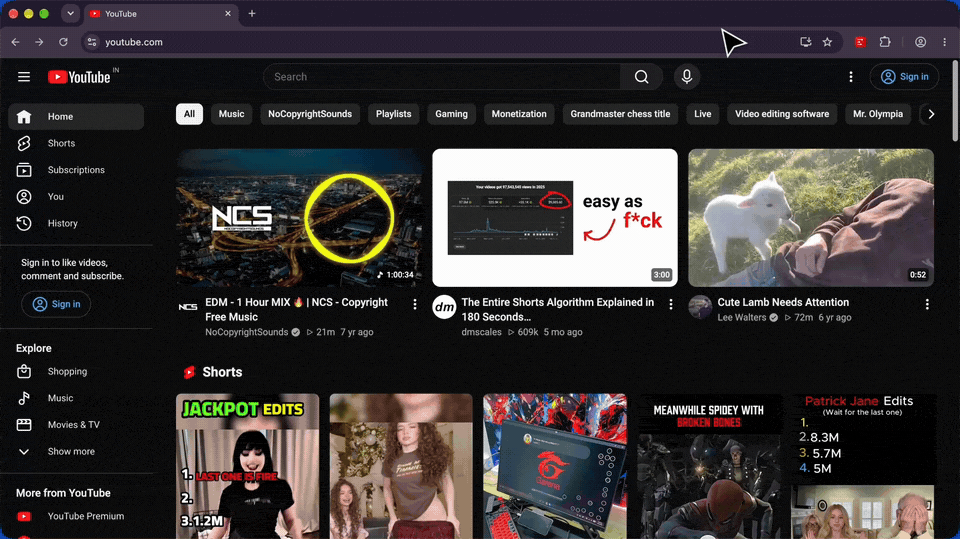

<p align="center">
  
</p>

<h1 align="center">DeTube</h1>

<p align="center">
  <strong>A premium, distraction-free YouTube experience.</strong><br/>
  Reclaim your focus by hiding algorithm-driven recommendations, social metrics, and clutter across the entire platform.
</p>

<p align="center">
  <a href="https://github.com/THANSHEER/detube/stargazers">
    
  </a>
  <a href="https://github.com/THANSHEER/detube/stargazers">
    
  </a>
  <a href="https://ko-fi.com/P0R02009G7">
    
  </a>
</p>

<p align="center">
  <a href="https://chromewebstore.google.com/detail/detube/kpnhjojmfhjkkkhfdhjbhpdbcpgmfcan">
    
  </a>
  <a href="https://addons.mozilla.org/en-US/firefox/addon/detube/">
    
  </a>
  <a href="https://microsoftedge.microsoft.com/addons/detail/detube/kpglkajecamcbjiokjbhghfgbicffmgh">
    
  </a>
  <a href="#-browser-support">
    
  </a>
</p>

<p align="center">
  <a href="https://github.com/THANSHEER/detube">
    
  </a>
  <a href="https://react.dev/">
    
  </a>
  <a href="https://tailwindcss.com/">
    
  </a>
  <a href="https://vite.dev/">
    
  </a>
  <a href="LICENSE">
    
  </a>
</p>

<p align="center">
  🌟 <strong>Love DeTube?</strong> Please consider giving us a <a href="https://github.com/THANSHEER/detube/stargazers"><strong>Star on GitHub</strong></a> or <a href="https://ko-fi.com/P0R02009G7"><strong>supporting on Ko-fi</strong></a> — it takes just 2 seconds and helps more people discover distraction-free YouTube!
</p>

<p align="center">
  
</p>

---

## ✨ Features

DeTube provides granular control over YouTube's interface, allowing you to curate exactly what you want to see:

| Area | Capabilities |
| :--- | :--- |
| **🧩 Global Header** | Hide search bar, voice search, notifications, and "Sign In" prompts. |
| **🏠 Homepage** | Hide the entire recommendation grid, Shorts shelves, and Trending sections. |
| **🎥 Video Page** | Center the player, enable grayscale mode, hide comments, related videos, and social metrics. |
| **👤 Channel Page** | Hide branding banners, subscriber counts, and specific navigation tabs (Shorts, Live, etc.). |
| **🎯 4 Focus Modes** | Always On, Focus Timer, Schedule, and Daily Limit. |

<p align="center">
  
</p>

---

## 🚀 Quick Start & Building from Source

```bash
# 1. Clone & install
git clone https://github.com/THANSHEER/detube.git
cd detube && npm install

# 2. Build CSS selectors
node scripts/build-css.js

# 3. Build for your target browser
TARGET_BROWSER=chrome node node_modules/.bin/vite build    # dist-chrome/
TARGET_BROWSER=firefox node node_modules/.bin/vite build   # dist-firefox/
TARGET_BROWSER=edge node node_modules/.bin/vite build      # dist-edge/
TARGET_BROWSER=opera node node_modules/.bin/vite build     # dist-opera/
TARGET_BROWSER=safari node node_modules/.bin/vite build    # dist-safari/
```

> 📖 **Looking for step-by-step browser loading or Xcode setup for Safari?**
>
> Check out our comprehensive [**CONTRIBUTING.md**](CONTRIBUTING.md) guide for browser-by-browser loading instructions, Apple Safari converter setup, and development guidelines.

---

## 🌐 Browser Support

DeTube is built with **Manifest V3** and supports all major modern browsers:

| Browser | Status | Output Folder |
| :--- | :--- | :--- |
| **Chrome / Arc / Brave** | ✅ Supported | `dist-chrome/` |
| **Firefox** | ✅ Supported *(AMO Sanitized)* | `dist-firefox/` |
| **Microsoft Edge** | ✅ Supported | `dist-edge/` |
| **Opera** | ✅ Supported | `dist-opera/` |
| **Safari** (macOS MV3) | ✅ Supported *(via Xcode converter)* | `dist-safari/` |

---

## 🛠️ Tech Stack

| Category | Technology |
| :--- | :--- |
| **Frontend** | [React 19](https://reactjs.org/) + [TypeScript](https://www.typescriptlang.org/) |
| **Build Tool** | [Vite 6](https://vitejs.dev/) |
| **Styling** | [Tailwind CSS](https://tailwindcss.com/) + CSS Custom Properties |
| **Icons** | [Lucide React](https://lucide.dev/) |
| **Storage** | Chrome Storage API (`local`) |

---

## 🤝 Contributing

We welcome contributions! Whether adding a new setting toggle, refining CSS selectors, or reporting bugs:
- Read our [**CONTRIBUTING.md**](CONTRIBUTING.md) for full setup instructions, architecture breakdown, and our 3-step guide to adding any setting.
- Ensure all automated checks pass before submitting a Pull Request:
  ```bash
  node scripts/validate-css.js && node scripts/validate-settings.js && node scripts/test-css-rules.js
  ```

---

## ⭐ Support the Project

If DeTube has improved your focus and productivity, here are quick ways you can support the project:

- ⭐️ **Star this repository:** Give us a star on [GitHub](https://github.com/THANSHEER/detube) — it takes just 2 clicks and helps others discover distraction-free YouTube.
- 📢 **Spread the word:** Share DeTube with friends, colleagues, or on [Twitter/X](https://twitter.com), [Reddit](https://reddit.com), and [LinkedIn](https://linkedin.com).
- ☕ **Buy me a coffee:** If you'd like to fuel ongoing development and new features:
  <br/>
  <a href="https://ko-fi.com/P0R02009G7">
    
  </a>
- 🐛 **Report bugs & suggest features:** Open a [GitHub Issue](https://github.com/THANSHEER/detube/issues) or join the discussions!

---

## 📄 License

Distributed under the MIT License. See `LICENSE` for more information.

<p align="center">
  Developed by <a href="https://geekstash.dev">GeekStash.dev</a>
</p>

